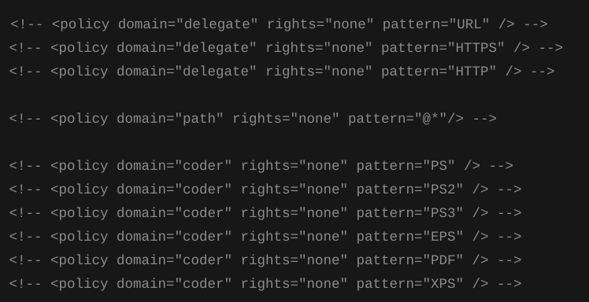
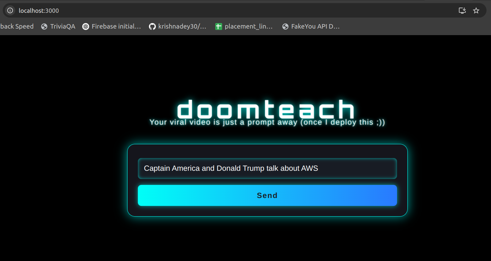

# DoomTeach

DoomTeach is a Python-based pipeline for generating short, entertaining video reels featuring iconic characters discussing various topics. It uses Google ADK for script generation, TTS (text-to-speech) synthesis, sticker/image retrieval, and video composition.

## Features

- **Script Generation:** Uses OpenAI/Shapes API to generate short scripts between two characters.
- **Character Identification:** Extracts character names from user prompts.
- **Voice Generation:** Synthesizes speech for each character using either FakeYou(character specific voice) or Shapes API. In `index.js`, you can change the code to use `pipeline.py`(uses fakeyou api for voice generation, character specific) or `pipeline2.py`(for voice generation by shapes api)
- **Sticker Download:** Downloads character images with transparent backgrounds.
- **Video Editing:** Composes a video with background, stickers, subtitles, and audio.

## Directory Structure

```
├── doomteach/
    ├── client/  # React frontend
    ├── server/  # Node.js backend
    ├── generator/
    │   ├── get_stickers.py
    │   ├── pipeline.py
    │   ├── pipeline2.py
    │   ├── script_generator.py
    │   ├── tts.py
    │   ├── tts2.py
    │   ├── video_editing.py
    │   ├── voice_generator.py
    │   ├── add_subtitles.py  
    ├── media/
        ├── bg_videos/
        ├── stickers/
        ├── generated/
            ├── audio/
            ├── video/
       

```

## Setup

1. **Clone the repository** and activate your virtual environment:
    ```bash
    git clone <repo-url>
    cd doomteach_parent
    source <path-to-venv>/bin/activate  # e.g., source ~/doom/bin/activate
    ```

2. **Install Python dependencies:**
    ```bash
    pip install -r requirements.txt
    ```

3. **Install JavaScript dependencies:**
    - For the React client:
      ```bash
      cd client
      npm install
      ```
    - For the Node.js server:
      ```bash
      cd ../server
      npm install
      ```
    - Return to the root directory when done:
      ```bash
      cd ..
      ```

4. **Environment Variables:**
    - Create a `.env` file in the root directory.
    - Add your API keys:
      ```
      SHAPES_API_KEY=<your_shapes_api_key_here>
      ```
    - Add your fakeyou api info:
      ```
      EMAIL="your fakeyou username"
      PASSWORD="your fakeyou password"
      ```

5. **Install system dependencies:**
    - For video editing, [ImageMagick](https://imagemagick.org/) and [ffmpeg](https://ffmpeg.org/) are required.
    - On Ubuntu:
      ```bash
      sudo apt-get install imagemagick ffmpeg
      ```

      You may have to grant some permissions using: 
      ```
      sudo gedit /etc/ImageMagick-6/policy.xml
      ```
      Comment out the lines as shown:
      


## Usage


1. **Start the backend server:**
    ```bash
    cd server
    nodemon index.js
    ```
   By default, this runs on [http://localhost:5000](http://localhost:5000).

2. **Start the frontend React app:**  
   In another terminal:  
    ```bash
    cd ../client
    npm start
    ```
   By default, this runs on [http://localhost:3000](http://localhost:3000).

   The React app will proxy API requests to the backend if configured.

3. **Generate a Reel:**

    Run the main pipeline with a user prompt:

    ```bash
    "Captain America and Donald Trump talk about AWS"
    ```
    

3. **Output:**

    Go to `doomteach/media/generated/video/final_video_with_subs.mp4`  
    This is the final video.


### Components

- **Script Generation:** `script_generator.py`
- **Voice Generation:** `voice_generator.py`+`tts.py` (FakeYou) or `tts2.py` (Shapes API)
- **Sticker Download:** `get_stickers.py`
- **Video Editing:** `video_editing.py`

## Notes

- Output videos and audio are saved in `media/generated/video` and `media/generated/audio`.
- Stickers are saved in `media/stickers`.
- ⭐ In `index.js`, you can change the code to use `pipeline.py`(uses fakeyou api for voice generation, character specific) or `pipeline2.py`(for voice generation by shapes api)
- Logs are written to `pipeline.log` or `pipeline2.log` in the `generator` directory.


## Future enhancements

- Expanding beyond educational videos
- Adding more background videos
- Agents to decide best sticker
- Progress Bar which tells you which step is going on


## Credits

Fakeyou and Shapes Inc.

## License

MIT License (add your license here)
